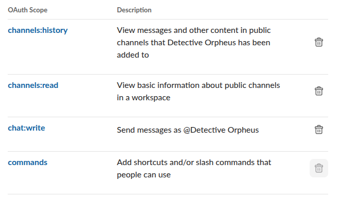
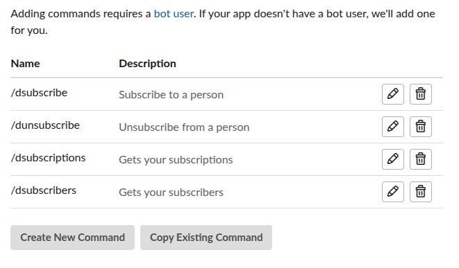

# detective-orpheus
See what your friends are doing for Summer of Making!

## [Demo](https://hackclub.slack.com/archives/D093C9K3QNA) (HackClub Slack only)

## Setup
1. Create a Slack app.
2. Install the app and enable socket mode. Also, don't forget to set up slash commands.


3. Change the channel ID and command prefix in `index.js` if needed.
4. Create a file named `.env`. In that file, save the Slack app tokens like this:
```
SLACK_BOT_TOKEN=xoxb-BotToken
SLACK_APP_TOKEN=xapp-AppToken
```
5. Install dependencies: `npm i`
6. Run: `npm start`